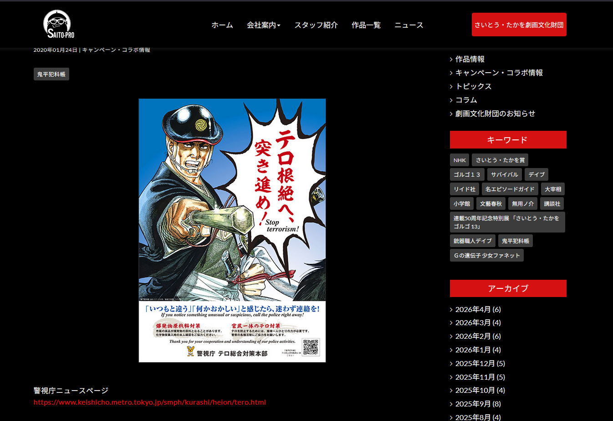
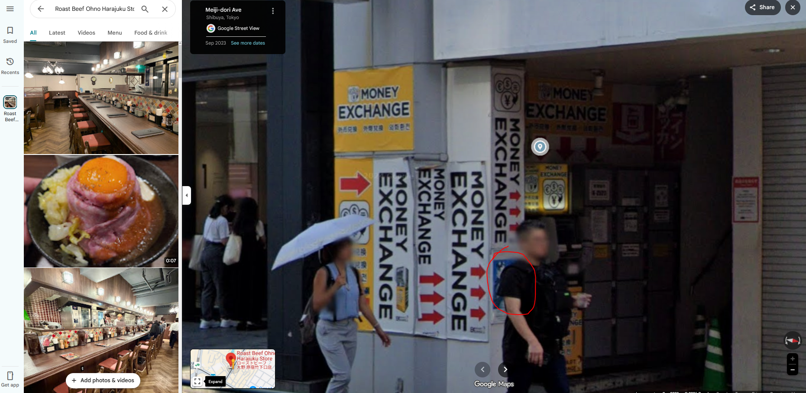

Played with UoftCTF, solved 1 OSINT chall

# Summer Trip by Ben 

## Description

Ohno, I took a photo of a poster on a trip and, I can not remember where I took it. Please help me find the coordinates.

The only things I remember was there was a yellow money exchange machine and a popular roast beef restraunt.

Flag format: texsaw{coordinates here}

For example the cordinates for the plinth at UTD are 32°59'14.26"N 96°44'53.87"W 

Used google Earth for cordinates by placing place mark. Plinth: https://calendar.utdallas.edu/su_mall_plinth

ex: texsaw{32_59_14N-96_45_53W}


## Solve

Reverse searching the image with the keywords "テロ根絶" (eradicate terrorism) brings us the website [https://www.saito-pro.co.jp/archives/2307](https://www.saito-pro.co.jp/archives/2307). Translating the page shows us that the poster was a collaboration between the manga "Onihira Hankacho" and the Tokyo Metropolitan Police Department, as well as a better resolution photo. 

Knowing the location, we can search "Popular Roast Beef Tokyo", and Tripadvisor shows a chain called Roast Beef Ohno. 

Looking at the [Harajuku branch](https://maps.app.goo.gl/RAoAPAPLkw9bd2hu9), we can immediately see the yellow Money Exchange, and upon closer inspection, the poster on the pillar near the signs (i actually spent like 10 extra minutes looking for the poster after posting the google maps link on discord, only for turtlegang/levu12 to point out that it was literally first thing you see when you open the link... ) 

After that, it was just a matter of putting the pin in google earth and copying the coords.

## Flag

```text
texsaw{35_40_11N-139_42_22E}
```

also tried the other osint but gave up after ~1 hour of looking at coastlines to try and match the photo